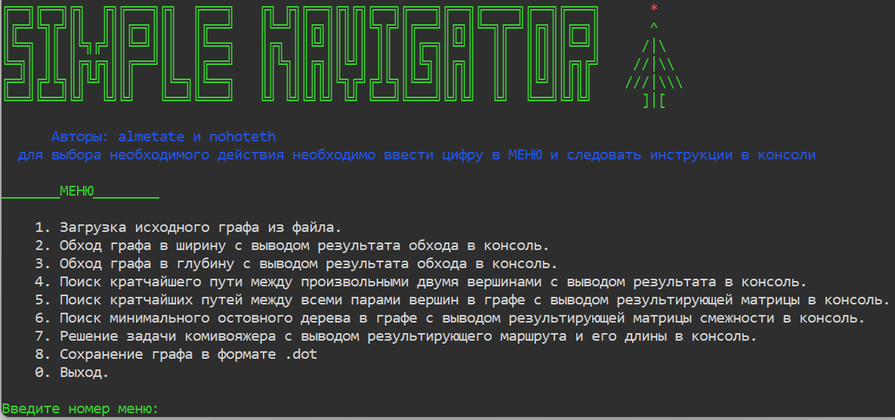
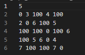
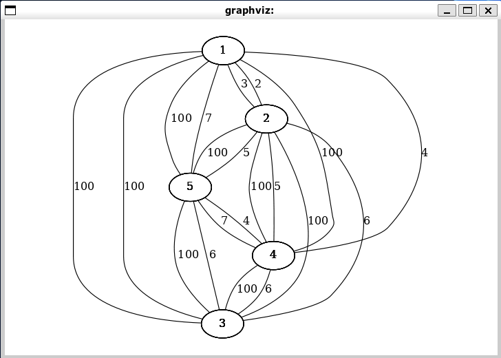
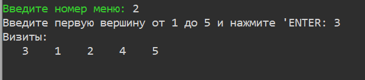
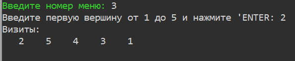
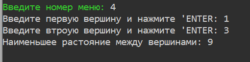
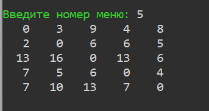
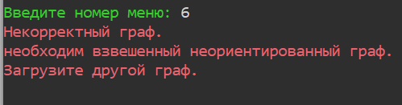
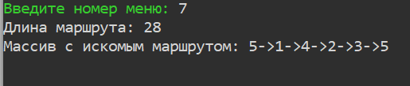

# SimpleNavigator

## Консольное приложение с реализацией некоторых видов алгоритмов для графов.

## Реализация графа
В данной реализации граф представлен в виде матрицы смежности, которая может быть загружена из txt файла:

Здесь первая строчка говорит о количестве вершин, остальные значения вес рёбер связывающих определенные вершины.

Так же реализована возможность сохранения файла в формат .dot или .gv который в линуксе может быть открыт командой `vimdot [название файла]`, где будет наглядно видно как связаны вершины и какой вес ребер:

Пункты меню с 2 по 7 реализуют следующие алгоритмы для графов (скриншоты вывода алгоритмов представлены для вышепоказанной мтарицы-графа):

## 2. Обход графа в ширину (BFS)
это алгоритм, используемый для обхода или поиска в графах и деревьях. Он начинается с выбранной вершины и обходит сначала все доступные вершины на текущем уровне перед переходом на следующий уровень.
Алгоритм BFS очень похож на Волновой алгоритм, так как волновой алгоритм относится к семейству алгоритмов основанных на методах поиска в ширину.
Обход в ширину работает на основе очереди

## 3. Обход графа в глубину (DFS)
DFS (depth first search) - это алгоритм, используемый для обхода или поиска в графах и деревьях. Он начинается с выбранной вершины и обходит все доступные вершины на максимальную глубину, прежде чем возвращаться к следующей непосещенной вершине.
Основное отличие BFS от DFS только в том, что BFS используется очередь а DFS используется stack, в остальном алгоритм обхода практически не отличается

## 4. Алгоритм Дейкстры
Алгоритм Дейкстры - это алгоритм нахождения кратчайшего пути от одной вершины графа до всех остальных вершин. Он работает только с неотрицательными весами ребер и является одним из самых эффективных алгоритмов для нахождения кратчайших путей в графах. В данной реализации возвращает общая сумма весов ребер найденного пути.

## 5. Алгоритм Флойда-Уоршела
Алгоритм Флойда-Уоршелла - это алгоритм поиска кратчайших путей во взвешенном и не ориентированном графк. алгоритм Возвращает матрицу той же размерности где указаны кратчайшие растояния мжду точнками.

## 6. Алгоритм Прима
Алгоритм Прима - это алгоритм нахождения минимального остовного дерева (MST) в связном взвешенном неориентированном графе. Он начинает с выбранной стартовой вершины и постепенно добавляет ребра с наименьшим весом, чтобы связать все вершины графа. РАБОТАЕТ С НЕОРИЕНТИРОВАНЫМ ГРАФОМ. Выводит новую матрицу смежности.

## 7. Муравьинный алгоритм

